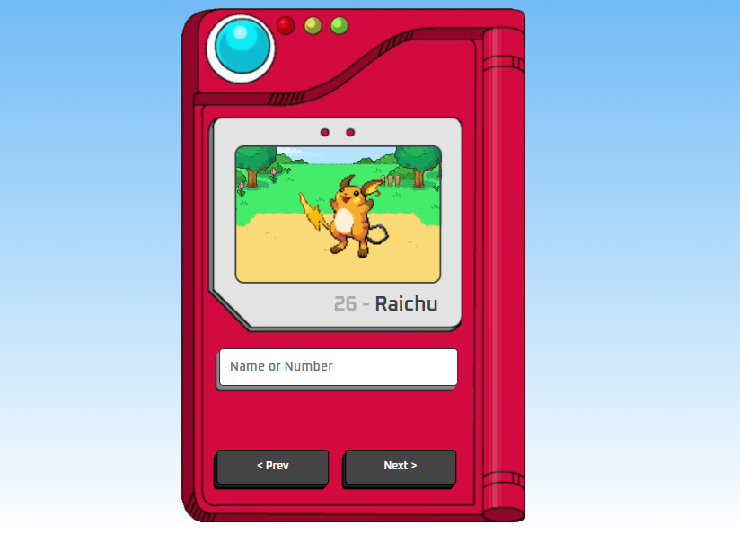

🚀 Pokedex Interativa: Consumo de API e Manipulação de Objetos
Este projeto é uma aplicação web que consulta a PokeAPI em tempo real para exibir informações detalhadas sobre Pokémons. Mais do que uma interface visual, o foco aqui foi o domínio do ciclo de vida de uma requisição e a renderização dinâmica de dados.

🛠️ O que este projeto demonstra (Hard Skills):
Consumo de API REST: Utilização de Fetch API (ou Axios) com funções assíncronas (async/await) para busca de dados externos.

Manipulação do DOM: Atualização dinâmica da interface baseada no retorno do JSON da API, sem a necessidade de recarregar a página.

Lógica de Filtros e Busca: Implementação de algoritmos de busca por nome ou ID, garantindo uma experiência de usuário (UX) fluida.

Tratamento de Erros: Gestão de estados para casos de busca de itens inexistentes ou falhas na conexão com o servidor.

📂 Estrutura Técnica:
Frontend: HTML5, CSS3 (com foco em responsividade) e JavaScript Vanilla.

Data Source: PokeAPI - Uma API RESTful completa.

Arquitetura: Separação de responsabilidades entre a lógica de busca (Script) e a estrutura visual.

🧠 Visão de Engenharia:
Para uma futura Engenheira de Dados, este projeto serviu como base para entender a Ingestão de Dados via API. 

📸 Visual do Projeto:

